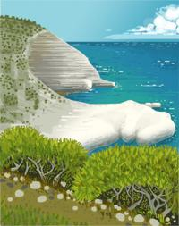
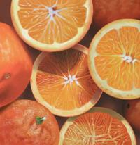
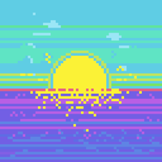

### My personal art hobby
  
In my free time I like to make illustrations and Graphic design! Check out my [illustrations](https://himl.tumblr.com/)

<!-- 

 -->

    

        
    

    

        
    

    

        
    

