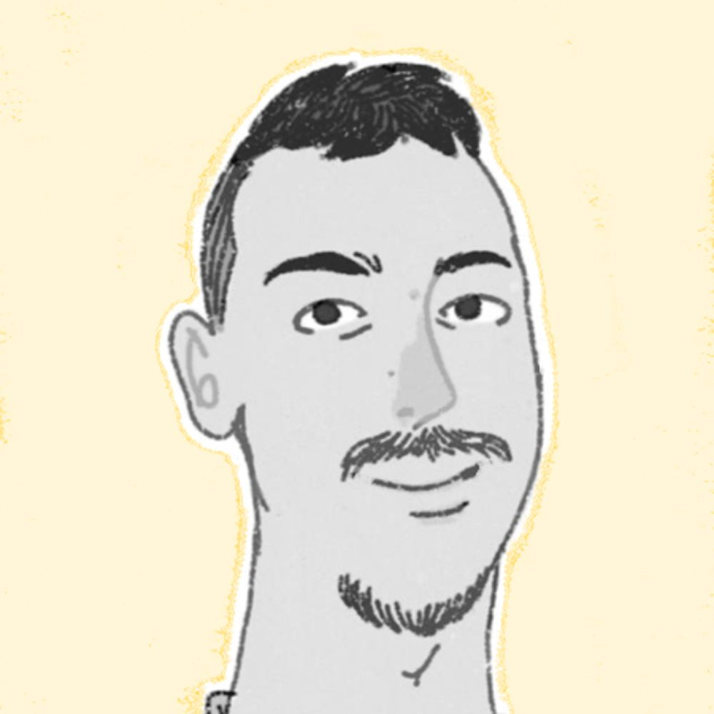

  <!--
  

    
  

  -->
  

    
My name is Hamza, a Data Scientist with experience in incorporating AI models (LLMs) in services. I'm also interested in system design, game development, IoT, robotics, and embedded systems.

    
In my free time, I usually explore game development, you can check some of my open-source projects on GitHub. I am also an illustrator, check my <a href="hobbies/sketches.md">sketches</a> 🎨.

  

This is where I share my notes.

## Recent Blog Posts

📋 Check out my [[posts/]]

## Resume

[Full resume](assets/files/resume.pdf)

  
2022 — <b>NLP Product Developer</b> <a href="https://dxc.com/us/en/offerings/insurance-software-bps/dxc-insurance-software/dxc-ai-solutions-for-insurance">@DXC Assure</a> · Hybrid

  <ul>
    <li>Fine-tuned BERT based model for the semantic similarity NLP task.</li>
    <li>Developed a Closed-domain Information retieval agent using Language models</li>
  </ul>

  
2022 — <b>Analytics developer</b> <a href="https://www.q2m2.com/">@Q2M2</a> · Freelance

  <ul>
    <li>Developed and Deployed Data & Analytics web apps #Python (Flask), #R (Shiny) #Docker</li>
  </ul>

  
2021 — <b>Freelance R/Python developer</b>

  <ul>
    <li>Collaborated with international clients to develop Decision-making tools & Analytics web apps.</li>
  </ul>

  
2019 — <b>Operations Data Analyst</b> @Mixtra

  <ul>
    <li>Developed transportation anomaly detection tool and evaluated fleet mobility and congestion.</li>
  </ul>

  
Before that

  <ul>
      

        
2018 — 📠Graduated from Ecole Mohammadia d’Ingénieurs - Morocco

        <ul>
          <li>M.eng. in engineering, Interested in Applied Machine Learning and control theory.</li>
        </ul>
      

      

        
2014 — 📚 Graduated in Applied Math from Ibn Zohr University - Morocco

        <ul>
          <li>Applied math, Physics, and Computer science.  Interested in Algebra, Computer graphics, and Understanding the laws of Physics.</li>
        </ul>
      

      

        
Before that

        <ul>
          <li>So you want to know more! In a nutshell, I liked to read science encyclopedias 📚, and drawing a lot 🎨.</li>
        </ul>
      

  </ul>

