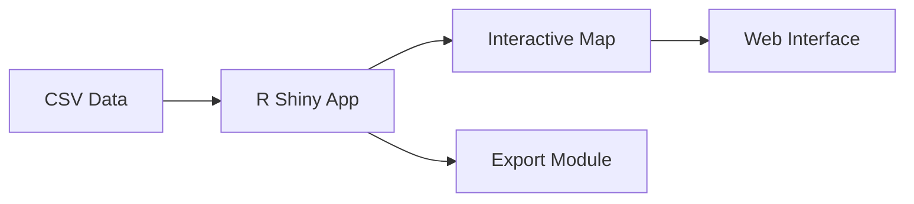

This article shares the story behind creating a custom map to visualize research center member locations. The project began when a client needed to replace their Google Maps-based solution with something more cost-effective and easier to maintain. Their manual process of updating location data was becoming unsustainable, especially since the Google Maps embedding service was incurring costs.

![[assets/images/bmscmap.jpg|Figure 1: Spatial map visualizing multiple categories]]
_Each color on this map represents a different membership category within the research community_

## The challenge

The client faced several limitations with their existing approach:

- Their Google Maps implementation lacked the specific visualization features needed for their growing database of members
- Manually updating location markers was becoming time-consuming and error-prone
When multiple members worked at the same institution, the map became cluttered with overlapping markers
- They needed to distinguish between different member types (faculty, students, collaborators) visually
- The solution needed to seamlessly integrate with their WordPress website

The main issue wasn't necessarily that Google Maps was prohibitively expensive, but rather that the client wanted a more customizable solution that would give them complete control over their data and visualization techniques without potential usage constraints in the future.

## The Solution

After evaluating several options, R with the leaflet mapping framework emerged as a good option. The open-source nature of these tools offered more customization possibilities. To handle the overlapping markers problem, we used the `OverlappingMarkerSpiderfier` in Leaflet - when clicking on a location with multiple members, the markers expand outward like a spider web, clearly revealing each individual.

Additionally, the map was made downloadable in a self-contained html page, which was then embedded into the website.

The workflow developed for the client looked like this:

<!--  -->

<!-- 
<iframe src="https://maper.onrender.com/" width="100%" height="500px"></iframe>
 -->

The client was particularly pleased with the "spider" feature that elegantly solved their overlapping markers problem. Another benefit was how the map revealed previously unnoticed patterns in their membership distribution - showing regional concentrations, category clusters, and international reach in ways that weren't apparent from their database.

[Link to the map.](https://bamfieldmsc.com/research-overview)

<blockquote class="twitter-tweet">
Where do our researchers come from? Check out our new interactive map! <a href="https://t.co/D5glRaTHuI">https://t.co/D5glRaTHuI</a><a href="https://twitter.com/UVicScience?ref_src=twsrc%5Etfw">@UVicScience</a> <a href="https://twitter.com/ubcscience?ref_src=twsrc%5Etfw">@ubcscience</a> <a href="https://twitter.com/SFU_Science?ref_src=twsrc%5Etfw">@SFU_Science</a> <a href="https://twitter.com/ualbertaScience?ref_src=twsrc%5Etfw">@ualbertaScience</a> @UofC_Science   constructed by: <a href="https://twitter.com/hamzaonde?ref_src=twsrc%5Etfw">@hamzaonde</a> <a href="https://t.co/hPc9ChceHD">pic.twitter.com/hPc9ChceHD</a>
&mdash; Bamfield MSC (@BamfieldMSC) <a href="https://twitter.com/BamfieldMSC/status/1442878031375204354?ref_src=twsrc%5Etfw">September 28, 2021</a></blockquote>  